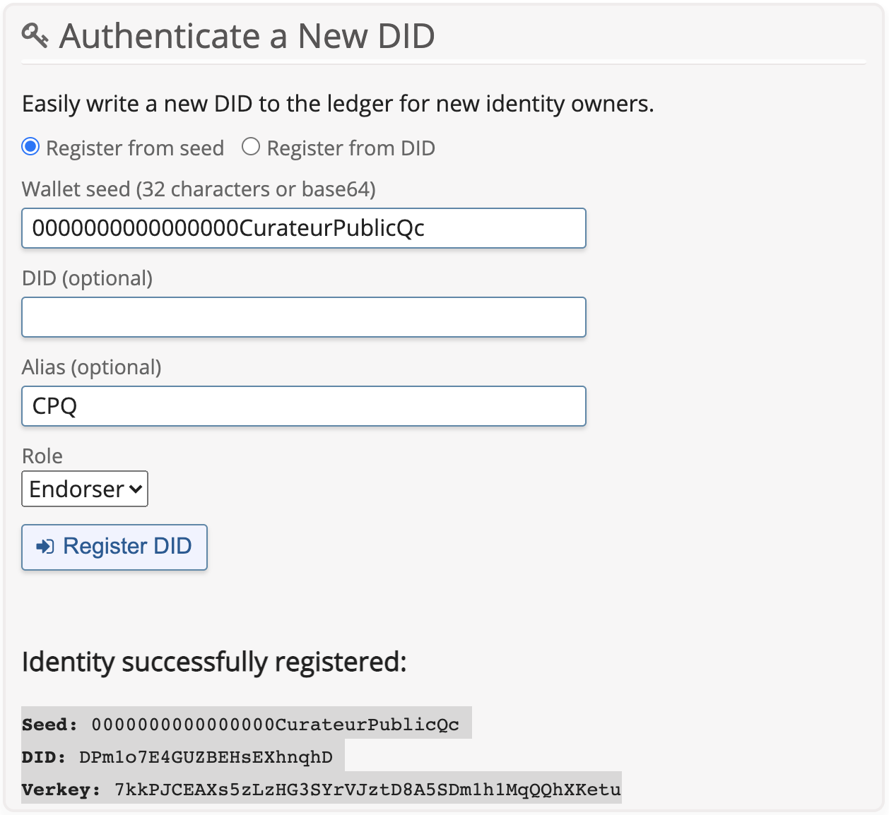

[<--- Retour](README.md)

# Demo 1 - Attestation déléguée

---

L'environnement d'expérimentation du CQEN est basé sur AWS & OpenShift (OKD).

Pour reproduire l'expérimentation vous allez installer les composants suivants:

- une chaîne de bloc (Blockchain)
- un explorateur de bloc (Ledger Client)
- une base de donnée (kms - key management service)
- un agent de communication (Agent)
- un site web comme controlleur (controller)

---

## Configurer le registre distribué

TODO

---

## [Optionel] Configurer la base de donnée

Nous utilisons dans les scripts de déploiements la base de donnée postgreSQL offert dans le marketplace d'OpenShift.

Note historique: le gouvernement de la province de la Colombie-Britannique au Canada a mis en œuvre et contribué au projet "Hyperledger Indy" une implémentation utilisant la base de données PostgreSQL pour les déploiements en entreprise.

### Au besoin vous pouvez éditer les variables d'environnement des bases de données dans les fichiers suivants:

- openshift/template/dec-template.yml
- openshift/template/mfa-template.yml

```YAML
          env:
          - name: POSTGRESQL_USER
            valueFrom:
              secretKeyRef:
                name: dec-kms
                key: database-user
          - name: POSTGRESQL_PASSWORD
            valueFrom:
              secretKeyRef:
                name: dec-kms
                key: database-password
          - name: POSTGRESQL_DATABASE
            valueFrom:
              secretKeyRef:
                name: dec-kms
                key: database-name
          - name: POSTGRESQL_ADMIN_PASSWORD
            valueFrom:
              secretKeyRef:
                name: dec-kms
                key: database-admin-password
```

---

## Configurer l'explorateur de bloc

TODO

---

## Configurer l'Agent

### [Optionel] Dockerfile changement des libellés

Si vous souhaitez changer le nom des organismes utilisés dans la démo, assurez-vous d'éditer la variable "label" dans les bons fichiers dockerfile. Ce nom va accompagner l'attestation et s'afficher dans l'application mobile portefeuille de l'utilisateur :

RQc-agent/Dockerfile

```bash
--label 'Registre Québec' \
```

CPQ-agent/Dockerfile

```bash
--label 'Curateur public du Québec' \
```

### Créer ou ajouter son DID public à la chaîne de bloc

Se créer un DID public sur la blockchain ou réutiliser celui fournie dans la démo sur votre chaîne de bloc. Si vous avez utilisez l'installation de la Province de la Colombie Britannique au Canada. Assurez-vous d'avoir ajouté l'explorateur de bloc. Vous aurez un interface graphique pour créer et/ou ajouter votre DID public sur votre chaîne de bloc. Si vous utilisez un autre réseau de blockchain que le votre, vous devrez utiliser les outils fournis pour créer et/ou ajotuer votre DID public.



### [Optionel] Renseigner l'agent avec la clé privé associé au DID public

Si vous avez ajouter notre DID public à votre chaîne de bloc vous n'avez rien à faire.

Si vous avez créé un nouveau DID vous devez mettre la bonne clé privé pour se connecter à la chaîne de bloc dans le fichier dec-template.yml à l'attribut value de l'issuer seed:

openshift/template/rqc-template.yml

```YAML
- name: ISSUER_SEED
  value: 0000000000000000000000RegistreQc
```

openshift/template/cpq-template.yml

```YAML
- name: ISSUER_SEED
  value: 0000000000000000CurateurPublicQc
```

---

## Configurer le controlleur

Afin que le controlleur fonctionne sur votre propre environnement OpenShift (OKD) vous devez mettre à jour les routes pour communiquer avec le site web.

Assurez-vous d'avoir les bons url dans les fichier .env et server.js dans les répertoires RQc-Controller & CPQ-Controller:

RQc-controller/.env

```
REACT_APP_ISSUER_HOST_URL=http://rqc-agent-admin.apps.exp.lab.pocquebec.org
```

CPQ-controller/.env

```
REACT_APP_ISSUER_HOST_URL=http://cpq-agent-admin.apps.exp.lab.pocquebec.org
```

Dans server.js , l'attribut HOST_URL

RQc-controller/server.js

```js
const HOST_URL =
  process.env.REACT_APP_ISSUER_HOST_URL ||
  "http://rqc-agent-admin.apps.exp.lab.pocquebec.org";
```

CPQ-controller/server.js

```js
const HOST_URL =
  process.env.REACT_APP_ISSUER_HOST_URL ||
  "http://cpq-agent-admin.apps.exp.lab.pocquebec.org";
```

---

## Créer le projet openshift

Vous pouvez procéder par votre interface graphique ou voici la procédure par ligne de commande.

- Authentifiez-vous à OpenShift sur votre terminal, habituellement vous trouverez la ligne de commande à utiliser dans l'interface graphique

```bash
oc new-project exp-att-del --display-name="Expérimentation Attestation Déléguée" --description="Expérimentation sur l'Attestation Déléguée en verifiable credential"
```

Assurez-vous d'êtres sur le bon projet

```bash
oc project exp-att-del
```

---

## Configurer clé d'accès github (optionel seulement si votre dépôt GitHub est privé)

### Créer le répertoire des clés

Ce répertoire faisant partie du .gitignore vous permettra de ne pas divulger vos paires de clés cryptographiques.

```bash
mkdir .ssh
cd .ssh
```

### Créer les clés de déploiment SSH

```bash
ssh-keygen -C "openshift-source-builder/exp-att-del@github" -f exp-att-del -N ''
```

### Configurer la clé privée de déploiment dans le projet OpenShift

**TODO** REMPLACER CETTE ÉTAPE PAR L'AJOUT D'UNE VARIABLE SECRET DANS LE TEMPLATE OPENSHIFT ET POINTER SUR LA CLÉ LORS DE L'EXÉCUTION DU TEMPLATE OPENSHIFT

```bash
oc create secret generic exp-att-del --from-file=ssh-privatekey=exp-att-del --type=kubernetes.io/ssh-auth
```

oc delete secret exp-att-del

```bash
oc secrets link builder exp-att-del
```

### Configurer la clé publique de déploiment dans le projet GitHub

Copier la clé sur Windows

```bash
xclip -sel c < exp-att-del.pub
```

Copier la clé sur Mac OSX

```bash
cat exp-att-del.pub | pbcopy
```

Ouvrir votre dépôt github, le notre est: https://github.com/CQEN-QDCE/demo1

- Dans l'onglet 'Settings',
- sous onglet 'Deploy keys',
  - supprimer la clé nommée 'openshift-source-builder' si elle existe
- Ajouter une clé nommée 'openshift-source-builder'
- et coller le contenu de la clé publique récupérée avec la commande xclip ou pbcopy (CTRL-V) ou (CMD-V)

### Supprimer les fichiers de clés.

**TODO** RETIRER LA SECTION MAINTENANT QUE LE RÉPERTOIRE .ssh EST DANS LE .gitignore

```
rm exp-att-del && rm exp-att-del.pub
```

---

## Démarrer l'installation des controlleurs

```bash
oc process -f openshift/templates/dec-template.yml -p GITHUB_WEBHOOK_SECRET=`cat .ssh/exp-att-del` | oc apply -f -
```

```bash
oc process -f openshift/templates/dec-template.yml -p GITHUB_WEBHOOK_SECRET=ssh-privatekey=`cat .ssh/exp-att-del` | oc apply -f -
```

```bash
oc process -f openshift/templates/dec-template.yml -p GITHUB_WEBHOOK_SECRET='$(cat .ssh/exp-att-del)' | oc apply -f -
```

#Configurer webhook authomatique avec github

#Configurer clé d'accès github (optionel si dépôt privé)
#Configurer webhook authomatique avec github

Démarrer l'installation du Site Web de l'émetteur

```bash
oc process -f mfa-template.yml | oc apply -f -
```

## Générer les schémas et les cred_def sur la chaîne de bloc

- S'assurer d'avoir le bon schéma et le bon cred_def

#TODO add explication create schema et cred_def
#TODO add explication create schema et cred_def

## old stock

S'assurer d'avoir le bon nom dans le dockerfile de l'agent qui va accompagner l'attestation pour que l'affiche fonctionne dans le portefeuille :
--label "Directeur de l'État Civil" \

Se créer un DID public sur la blockchain ou réutiliser celui fournie dans la démo sur votre chaîne de bloc.

Mettre la bonne clé privé pour se connecter à la chaîne de bloc dans le fichier dec-template.yml à l'attribut value de l'issuer seed:

- name: ISSUER_SEED
  value: 000000000000DirecteurEtatCivilQc

S'assure d'avoir les bons url dans les fichier .env et server.js dans DEC-Controller
Dans .env , l'attribut REACT_APP_ISSUER_HOST_URL + S'assurer d'avoir le bon schéma et le bon cred_def
Dans server.js , l'attribut HOST_URL

#Créer le projet openshift
oc new-project exp-att-del --display-name="Expérimentation Attestation Déléguée" --description="Expérimentation sur l'Attestation Déléguée en verifiable credential"
oc project exp-att-del

#Démarrer l'installation de l'application du Directeur de l'État Civil du Québec
oc process -f dec-template.yml | oc apply -f -

#Configurer clé d'accès github (optionel si dépôt privé)
#Configurer webhook authomatique avec github
#TODO add explication create schema et cred_def

#Démarrer l'installation du Site Web de l'émetteur
oc process -f mfa-template.yml | oc apply -f -

#Configurer clé d'accès github (optionel si dépôt privé)
#Configurer webhook authomatique avec github
#TODO add explication create schema et cred_def

[<--- Retour](README.md)
